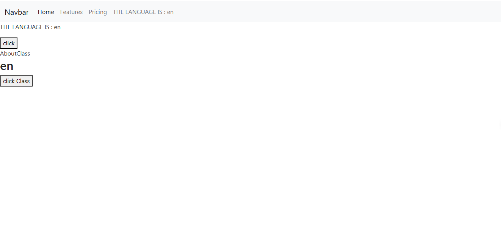

# React-Redux-Class-component-iti  
# React-Redux[mapStateToProps, mapdispatchtoprops]-Class-component-iti

This is not a real project .it just a simple one built with ReactJs [class-component] and redux[mapStateToProps, mapdispatchtoprops]. for learning and trying.

## Table of contents

- [Overview](#overview)
- [Installation](#Installation)
- [Usage](#Usage)
- [Links](#Links)
- [Screenshot](#Screenshot)
- [Author](#author)
- [Acknowledgments](#Acknowledgments)


## overview
This is not a real project .it just a simple one built with ReactJs [class-component] and redux[mapStateToProps, mapdispatchtoprops]. for learning and trying.

## Installation
To get started with this project, follow these steps:

you can clone the project or download it as Zip file.
1. Clone the repository:
   ```bash
   git clone https://github.com/olahasan/React-Redux-Class-component-iti.git

2. Navigate to the project directory:
   cd <project-directory>

3. Install the required dependencies:
   npm install   


## Usage
To run the application, use the following command:

npm start


## Links

If you want to open the link in a new tab, you can:

- Press **Ctrl** (or **Cmd** on Mac) while clicking the link.
- Right-click the link and select **Open link in new tab**.

Otherwise, all links will open in the same tab.


- Solution URL: [here](https://github.com/olahasan/React-Redux-Class-component-iti)

- Live Site URL: [here](https://redux-classcomponent-iti.surge.sh/) OR [here](https://redux-classcomponent-iti.netlify.app/)

 ## Screenshot
 


### Author

GitHub - @olahasan

### Acknowledgments

I would like to thank the **[iti](https://iti.gov.eg/home)** for providing this challenge and to the community for their support.

